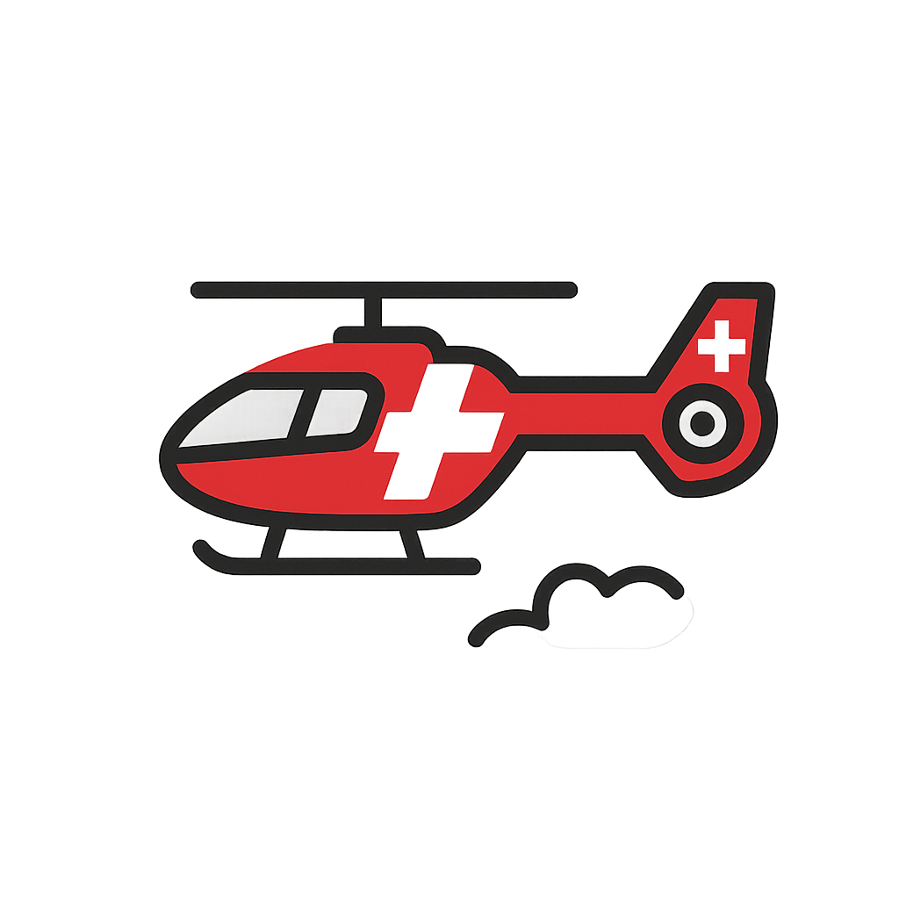

# PreHosp
Analysis of the Swiss REGA Helicopter Emergency Medical Service data 

##### Published work: 
> Pietsch U, Satari B, Klug J, et al. Glasgow coma scale score before prehospital tracheal intubation in trauma vs. nontrauma patients: A multicentre retrospective observational study. Eur J Anaesthesiol. Published online August 25, 2025. doi:10.1097/EJA.0000000000002263
